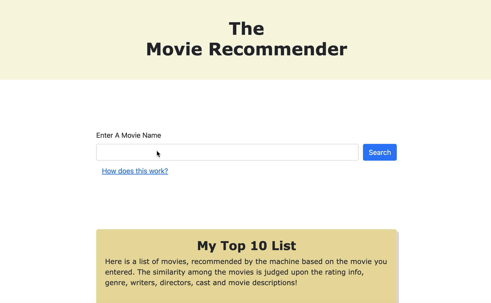

# Movie Recommendation Engine

I combined two large datasets (netflix movie dataset and IMDb movie ratings) from Kaggle and cleaned them for preprocessing. After doing some minor data analysis to view movies by popularity and other filters, I then proceeded with building a unsupervised machine learning model that was ideal with the data type I had, explicit movie attributes (movie directors, cast, genres, writers, year of release etc), and for the intended final goal of this project. This meant starting with content-based filtering, in which I would perform preprocessing for the explicit movie data, then utilizing NLP via TF-IDF Vectorization to measure the frequency of each movie attribute text that I combined into one big column, and to measure its rarity in relation to all the other text. This resulted in the recommendation engine to produce a 5134x5134 similarity matrix (each movie measured with all other movies in the dataset). I proceeded to design a flask app sketch and began working on the front-end files (HTML,CSS,JS) and played out with it once again for the easiest to design layout. Finally I worked on making the flask dynamic with the model which in the result produced the demo below! 

This repository consist's of 4 large parts listed below, more detail can be accessed through the actual files. 

1. Exploratory data analysis with data cleaning
2. Unsupervised machine mearning with NLP (Natural Language Processing)
   i. Content-based filtering
   ii. TF-IDF Vectorization, resulting in the recommendation engine
3. Front-end development of the FLASK application
4. Back-end developent, making the application dynamic with the recommendation engine

If you want to read more regarding the critical thinking applied through out the process, feel free to read my article inspired by this project.  

https://medium.com/@qudsia1999/things-i-learned-while-building-a-movie-recommendation-model-df6b46f5c59b

Contributor : Qudsia Ahmad
